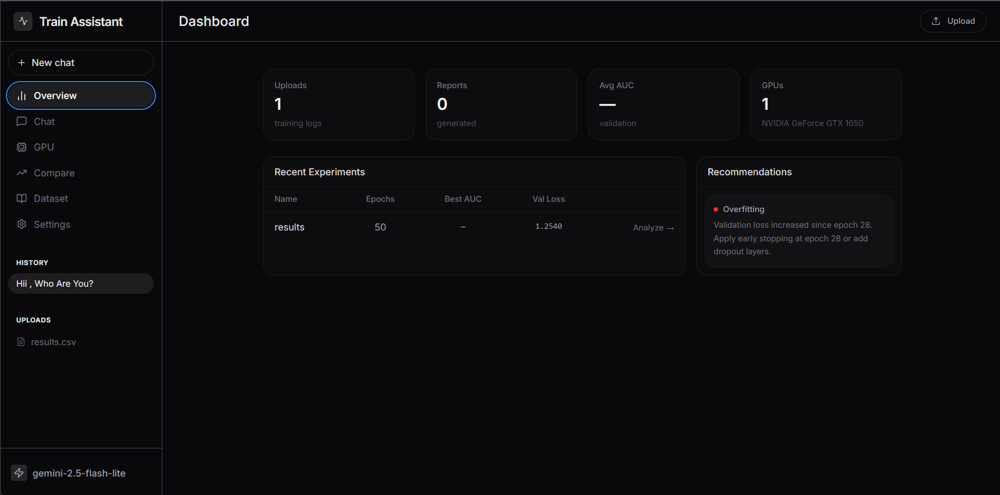
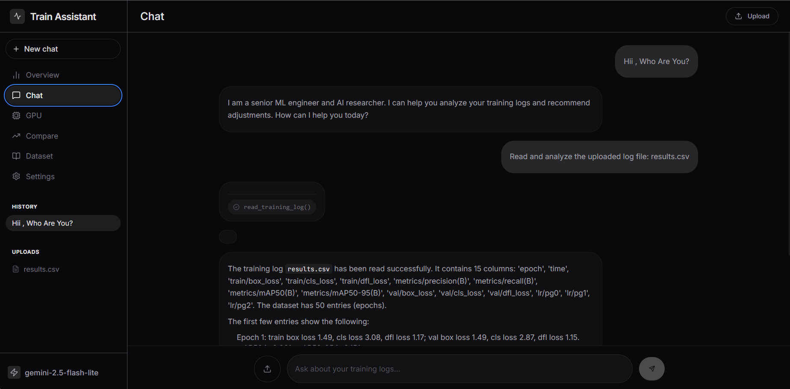
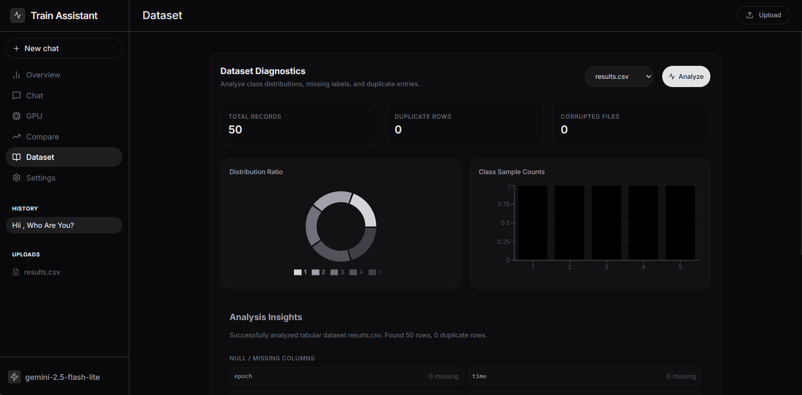
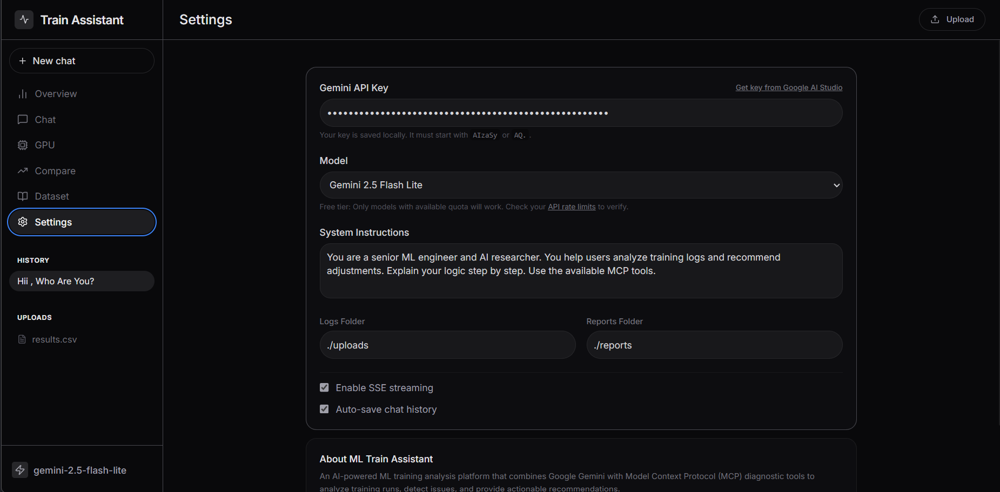

# ML Training Assistant


> **An AI-Powered Machine Learning Training Analysis Platform built with Google Gemini, FastAPI, React, and Model Context Protocol (MCP).**

ML Training Assistant is an intelligent platform designed to help machine learning engineers, researchers, and students analyze training runs, diagnose optimization issues, compare experiments, visualize metrics, and generate comprehensive reports using natural language.

The system combines the reasoning capabilities of **Google Gemini** with **MCP-powered diagnostic tools** to provide reliable, explainable, and actionable insights for deep learning workflows.

---

# Features

## AI Chat Assistant

* Natural language interface powered by Google Gemini
* Multi-turn conversation support
* Context-aware reasoning
* Automatic MCP tool invocation
* Streaming responses using Server-Sent Events (SSE)

Example:

```text
User:
Analyze my training log.

Assistant:
✓ Reading training log
✓ Detecting overfitting
✓ Evaluating validation metrics
✓ Generating recommendations

Overfitting detected after Epoch 14.
Recommended action:
• Restore checkpoint from Epoch 13
• Reduce learning rate
• Increase dropout
```

---

# Training Log Analysis

Analyze CSV training logs and extract:

* Training Loss
* Validation Loss
* Validation Accuracy
* Validation AUC
* Learning Rate
* Epoch Statistics

Automatically identify:

* Best Epoch
* Best Validation Score
* Convergence Point
* Plateau Detection

---

# Intelligent Diagnostics

Automatically detect:

* Overfitting
* Underfitting
* Learning stagnation
* Validation instability
* Performance plateau
* Early stopping opportunities

Provides human-readable explanations instead of raw metrics.

---

# Hyperparameter Recommendations

Generate optimization suggestions including:

* Learning Rate adjustment
* Optimizer selection
* Scheduler recommendation
* Batch size estimation
* Dropout tuning
* Training duration estimation

---

# Interactive Visualization

Generate and display:

* Loss Curves
* Validation Curves
* AUC Curves
* Learning Rate Curves
* Experiment Comparison Charts

All charts are automatically saved and available for download.

---

# Experiment Comparison

Compare multiple training runs side by side.

View:

* Best AUC
* Best Validation Loss
* Convergence Speed
* Best Epoch
* Overall Winner

Ideal for hyperparameter tuning experiments.

---

# Dataset Analyzer

Analyze datasets for:

* Duplicate samples
* Corrupted images
* Missing labels
* Class imbalance
* Dataset statistics

Helps identify data quality issues before training.

---

# GPU Monitoring

Monitor system resources in real time.

Displays:

* GPU Name
* VRAM Usage
* Available Memory
* Estimated Batch Capacity
* GPU Temperature (when supported)

---

# Automatic Report Generation

Generate comprehensive Markdown reports containing:

* Training Summary
* Best Metrics
* Charts
* Diagnostic Findings
* Recommendations
* Hyperparameter Suggestions

Reports are automatically stored for future reference.

---

# System Architecture

```text
                           +-------------------------+
                           |     React Frontend      |
                           +-----------+-------------+
                                       |
                                 HTTP / SSE
                                       |
                           +-----------v-------------+
                           |     FastAPI Backend     |
                           +-----------+-------------+
                                       |
                        +--------------+--------------+
                        |                             |
                  Google Gemini API            MCP Client
                                                      |
                                            +---------v---------+
                                            |    MCP Server     |
                                            | Diagnostic Tools  |
                                            +---------+---------+
                                                      |
                    --------------------------------------------------------
                    |          |          |          |          |           |
             Log Parser   GPU Monitor   Charts   Reports   Dataset AI   Comparison
```

---

# Technology Stack

## Backend

* Python 3.11+
* FastAPI
* Uvicorn
* Pydantic
* pandas
* NumPy
* matplotlib

## AI

* Google Gemini API
* Gemini 2.5 Flash
* Gemini 2.5 Pro

## MCP

* Model Context Protocol (Python SDK)

## Frontend

* React
* TypeScript
* Vite
* Tailwind CSS
* shadcn/ui
* React Markdown
* Framer Motion

---

# Project Structure

```text
ml-training-assistant/

├── backend/
│   ├── db.py
│   └── main.py
│
├── frontend/
│
├── mcp/
│   └── server.py
│
├── uploads/
│    └── db.json
├── reports/
├── publics/
├── charts/
├── training_logs/
│
├── tests/
│    └── test_mcp.py
│
├── requirements.txt
├── README.md
├── LICENCE
├── .gitignore
└── .env.example
```

---

# Installation

## 1. Clone the repository

```bash
git clone https://github.com/Argha2004/Train-Assistant.git

cd Train-Assistant
```

---

## 2. Create a virtual environment

### Windows

```bash
python -m venv .venv

.venv\Scripts\activate
```

### Linux / macOS

```bash
python3 -m venv .venv

source .venv/bin/activate
```

---

## 3. Install backend dependencies

```bash
pip install -r requirements.txt
```

---

## 5. Install frontend dependencies

```bash
cd frontend

npm install
```

---

# Running the Application

## Backend

```bash
uvicorn backend.main:app --reload
```

Runs at:

```
http://localhost:8000
```

---

## Frontend

```bash
cd frontend

npm run dev
```

Runs at:

```
http://localhost:5173
```

---

# API Endpoints

## Chat

```
POST /api/chat
```

Run AI-powered diagnostics.

---

## Upload

```
POST /api/upload
```

Upload training logs.

---

## Dashboard

```
GET /api/dashboard
```

Retrieve project statistics.

---

## GPU

```
GET /api/gpu
```

Get GPU telemetry.

---

## Reports

```
GET /api/reports
```

Retrieve generated reports.

---

## Upload History

```
GET /api/uploads
```

List uploaded training logs.

---

# MCP Diagnostic Tools

The assistant can invoke specialized tools including:

* `read_training_log`
* `get_best_epoch`
* `get_best_auc`
* `detect_overfitting`
* `detect_underfitting`
* `detect_plateau`
* `estimate_best_epoch`
* `recommend_learning_rate`
* `recommend_batch_size`
* `recommend_optimizer`
* `recommend_scheduler`
* `compare_runs`
* `plot_loss_curve`
* `plot_auc_curve`
* `plot_lr_curve`
* `dataset_analyzer`
* `gpu_monitor`
* `generate_report`

These tools execute independently through the MCP server and provide structured outputs for Gemini to reason over.

---

# Screenshots

Add project screenshots here.

* Home Page


* AI Chat


* Dataset Analyzer


* Settings


---

# Use Cases

* Deep Learning Research
* Computer Vision Projects
* NLP Model Development
* Hyperparameter Optimization
* Academic Research
* Kaggle Competitions
* Training Debugging
* Experiment Tracking

---

# Security

* File validation
* Safe upload handling
* Input sanitization
* MIME type verification
* Structured logging
* Error isolation

---

# License

This project is released under the MIT License.

---

# Author

**Arghadeep Pakhira**
Developed as an AI-powered Machine Learning Engineering Assistant using:

* Google Gemini
* FastAPI
* React
* Model Context Protocol (MCP)

